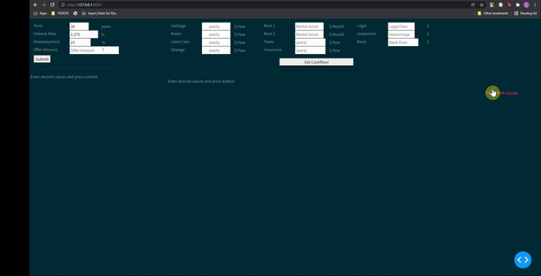

# real_xstate
Plotly Dash app that evaluates potential real estate investment deals and keeps track of current investments.
The app takes all impotrant metrics (such as mortgage term, property offer, utility costs, income from rent, taxes etc) and creates a investment full under realistic  ('real') and optimal ('hypo') conditions. 
Values calculated to evaluate if a property is a good investment include: __ROI, cash-on-cash ROI, breakeven date, cashflow__. 
Result can be exported to a text file by hitting the dedicated button.
  

Installation: 

Clone repo:  
`git clone https://github.com/lasupernova/real_xstate.git`

Install dependencies: 
`pip install -r requirements.txt`

Usage: 

Running the following command will run flsak contanign a Plotly Dash app:
`python app.py`
  
Open app in browser (while the command above is running):
Open to Browser > Go to Localhost (port 8050) `http://127.0.0.1:8050/`
  

